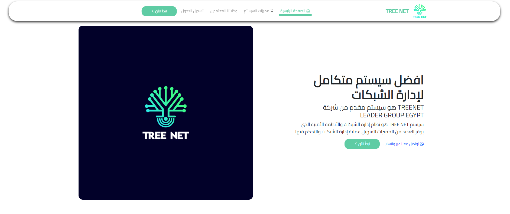

# Tree Net
powered by: **Leader Group Egypt**
You can visit **`Leader Group Egypt`** website from [here](https://leadergroupegypt.com) or type this URL in your browser `https://leadergroupegypt.com`

## Used tools
 1. HTML5
 2. CSS3
 3. Bootstrap v5.3
 4. JavaScript
 5. PHP
 6. MySQL
 7. DataTables

## Main idea
The system is used to help network owners manage their network easily and smoothly, and deal with network faults and new installations within the network. You can visit the official website from [here](https://tree-net.net)

## Get a copy 
you can get a copy of this project by type this command in your **command prompt** `git clone https://github.com/Ahmed-Hassib/treenet.git`

## More about the application
The main color is `#5FCCA4` which in the application logo.